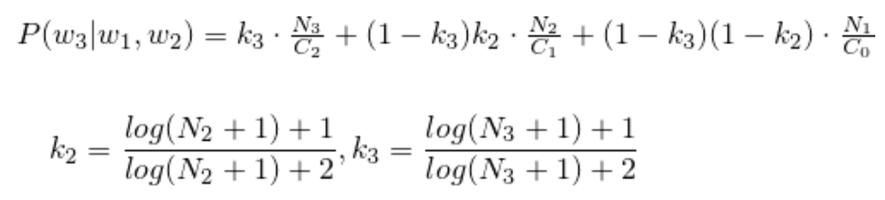

# Hebrew Word Prediction on AWS EMR (MapReduce)

A production-style data engineering/NLP pipeline that builds a trigram-based knowledge base for Hebrew word prediction using Hadoop MapReduce on Amazon EMR. The system ingests the Google Books Hebrew N‑Grams (1‑gram/2‑gram/3‑gram), computes smoothed conditional probabilities P(w3 | w1, w2), and writes an ordered knowledge base for suggestion/ranking use cases.

### Objective
- **Build** a scalable pipeline that computes next‑word probabilities for Hebrew given two preceding words.
- **Operate at dataset scale** using distributed processing (Hadoop on EMR) and S3 for storage.
- **Produce** an ordered knowledge base per bigram `(w1, w2)` with candidate next words `w3` and their probabilities.

### Probability Model (Thede & Harper)
We estimate the conditional probability with a backoff smoothing scheme that blends trigram, bigram, and unigram evidence:



Where:
- `N1` is the number of times `w3` occurs.
- `N2` is the number of times sequence `(w2, w3)` occurs.
- `N3` is the number of times sequence `(w1, w2, w3)` occurs.
- `C0` is the total number of word instances in the corpus.
- `C1` is the number of times `w2` occurs.
- `C2` is the number of times sequence `(w1, w2)` occurs.

This combines Maximum Likelihood Estimation with backoff smoothing (k2, k3 as shown in the figure) to avoid zero‑probability issues and better generalize for sparse trigrams.

---

## Solution Architecture

- **Step 1 – Counting and Preparation (MapReduce)**
  - Reads Hebrew Google Books N‑Grams from S3 using `SequenceFileInputFormat` (1‑gram, 2‑gram, 3‑gram).
  - Removes Hebrew stop words to avoid skew and reduce noise.
  - Emits and aggregates the counts required for the model: `N1`, `N2`, `N3`, `C1`, `C2` and captures `C0` (total tokens) via a Hadoop Counter.
  - Writes two logical record types to output:
    - `N` records for `(w1, w2, w3) → N1, N2, N3`
    - `C` records for `(w1, w2) → C1, C2`
  - Persists `C0` to `C0.txt` in the Step 1 output directory on S3 so Step 2 can use it without recomputation.

- **Step 2 – Probability Computation (MapReduce)**
  - Loads `C0` from Step 1 output.
  - For each trigram `(w1, w2, w3)`, joins `N` and `C` aggregates and computes the smoothed probability using the Thede & Harper formulation.
  - Groups results by `(w1, w2)` so downstream consumers can rank candidate `w3` values by probability. For presentation, results can be sorted by probability descending per pair.

- **Orchestration (aws‑client)**
  - A minimal EMR launcher that provisions a transient EMR cluster, wires the two JAR steps, and points them to S3 paths for input/output and logs.

### Tiny pipeline diagram
```
S3 (Google Hebrew N‑Grams)
   ├── 1‑gram (seqfiles) ┐
   ├── 2‑gram (seqfiles) ├─▶ Step 1 (MapReduce)
   └── 3‑gram (seqfiles) ┘      ├─ aggregates N1/N2/N3 and C1/C2
                                 ├─ writes C0.txt
                                 └─ outputs: N and C records  ──▶ s3://<bucket>/output_step1

Step 2 (MapReduce)
   ├─ reads output_step1 + C0.txt
   ├─ joins N & C per (w1,w2)
   └─ computes P(w3|w1,w2)      ──▶ s3://<bucket>/output_step2
```

---

## Implementation Highlights

- **Custom composite keys and partitioners**
  - Step 1 uses a `CompositeKey(type, w1, w2, w3)` and a dedicated partitioner:
    - `N` records are partitioned by `w3` and ordered so denominators arrive before numerators per reducer.
    - `C` records are partitioned by `w2` with ordering that ensures `C1` precedes `C2`.
  - A combiner performs local summation to reduce shuffle volume.

- **Counters and cross‑step state**
  - `C0` is tracked via a Hadoop Counter in the unigram mapper and written to `C0.txt` at the end of Step 1. Step 2 reads it from S3 during reducer setup.

- **Stop‑word filtering**
  - A curated Hebrew stop‑words list is applied across uni/bi/tri‑gram inputs to improve prediction quality and efficiency.

- **Data ordering**
  - Output is grouped by `(w1, w2)` and includes a probability for each `w3`. For consumer UIs and analysis we sort each group by probability descending.

---

## How to Run

Prerequisites:
- Java 8, Maven 3.6+
- AWS account with EMR, EC2, and S3 permissions; default EMR roles (`EMR_DefaultRole`, `EMR_EC2_DefaultRole`)
- Configured AWS credentials (e.g., `~/.aws/credentials` via `aws configure`)
- An S3 bucket for JARs, outputs, and logs

1) Build the modules
```
# From repo root
mvn -DskipTests package
```
Artifacts:
- `step1/target/step1-1.0-SNAPSHOT.jar` (MapReduce Step 1)
- `step2/target/step2-1.0-SNAPSHOT.jar` (MapReduce Step 2)
- `aws-client/target/aws-client-1.0-SNAPSHOT-shaded.jar` (EMR launcher)

2) Upload the step JARs to S3
```
aws s3 cp step1/target/step1-1.0-SNAPSHOT.jar s3://<your-bucket>/step1.jar
aws s3 cp step2/target/step2-1.0-SNAPSHOT.jar s3://<your-bucket>/step2.jar
```

3) Configure the EMR launcher
- Edit `aws-client/src/main/java/org/example/App.java`
  - Set `numberOfInstances` (e.g., 5–9)
  - Update S3 bucket paths and region to match your account

Configuration notes:
- Step 1 and Step 2 currently reference S3 paths in code. Either create the bucket `yuvalhagarwordprediction` or update these locations to your bucket name:
  - `step1/Step1.java` output path: `s3://<your-bucket>/output_step1`
  - `step2/Step2.java` input path: `s3://<your-bucket>/output_step1`
  - `step2/Step2.java` output path: `s3://<your-bucket>/output_step2`
  - `step2/Step2.java` C0 file path: `s3://<your-bucket>/output_step1/C0.txt`

4) Run the EMR job flow
```
java -jar aws-client/target/aws-client-1.0-SNAPSHOT-shaded.jar
```
Outputs:
- Step 1: `s3://<your-bucket>/output_step1/` + `C0.txt`
- Step 2: `s3://<your-bucket>/output_step2/` with `(w1 w2 w3)\tprobability`

Notes:
- During development we also tested with small text files via `TextInputFormat` (see commented paths in Step 1).
- The production run uses `SequenceFileInputFormat` to read the Google Books N‑Gram sequence files in S3.

---

## Results and Scalability

- With local aggregation (combiner):
  - Step 1: 213,616,669 KV pairs, ~800 MB shuffled
  - Step 2: 1,721,484 KV pairs, ~33 MB shuffled (no combiner)
  - 9 instances: ~15 minutes end‑to‑end
  - 5 instances: ~35 minutes end‑to‑end

- Without local aggregation:
  - Step 1: 348,608,126 KV pairs, ~1.18 GB shuffled
  - ~47 minutes total

These measurements show the value of local aggregation and appropriate partitioning to reduce shuffle cost and wall‑clock time.

---

## Example Predictions (top‑5 per pair)

Below is a sample from the generated knowledge base (Hebrew):

- בתי מדרש → למורים (0.779), וישיבות (0.137), הרבנים (0.135), לתורה (0.134), החכמה (0.110)
- היום יום → ראשון (0.037), רביעי (0.016), שלישי (0.015), טוב (0.014), חמישי (0.013)
- חבר ועד → הלשון (0.681), הקהילה (0.282), הרבנים (0.236), הצירים (0.161), הפועל (0.057)
- הגאון הרב → יוסף (0.052), יצחק (0.031), אברהם (0.029), שלמה (0.029), משה (0.027)
- תרומה חשובה → ביותר (0.346), מאוד (0.132), לחקר (0.039), לתולדות (0.036), להבנת (0.035)
- עמוד הענן → יומם (0.094), ועמוד (0.050), מפניהם (0.041), ועמד (0.027), עומד (0.015)
- ריח רע → נודף (0.018), שיש (0.018), שאין (0.014), עולה (0.012), מפיו (0.010)
- קשה גם → להניח (0.026), להבין (0.021), לדעת (0.015), לקבל (0.014), לקבוע (0.009)
- נבנה בית → המקדש (0.280), הכנסת (0.195), כנסת (0.083), המדרש (0.017), הבחירה (0.011)
- לבקר בבית → הספר (0.126), הקברות (0.089), החולים (0.063), הכנסת (0.048), ספר (0.042)

---

## Tiny sample: Step 1 → Step 2 for one trigram

Illustrative lines (tabs between fields) using placeholder tokens:

Step 1 outputs
```
# C record: (w1, w2) with C1 and C2
C	alpha	beta	5000	300

# N record: (w1, w2, w3) with N1, N2, N3
N	alpha	beta	gamma	2000	120	30

# C0 stored as a single number in C0.txt
1000000
```

Step 2 output
```
alpha beta gamma	0.085
```

Explanation: Using the Thede & Harper smoothing as implemented, with `C0=1,000,000`, `C1=5000`, `C2=300`, `N1=2000`, `N2=120`, `N3=30`, the reducer computes `P(gamma|alpha, beta) ≈ 0.085`.

---

## Tech Stack and Skills Demonstrated

- **Distributed Systems**: Hadoop MapReduce on Amazon EMR; shuffle reduction via combiners; custom partitioners and sort orders; counters and cross‑step state.
- **Cloud & DevOps**: EMR/EC2/S3 orchestration with AWS SDK; transient clusters; logs and artifacts in S3.
- **Data Engineering**: Handling large sequence files; multi‑input jobs; efficient key design; join‑style aggregation across steps.
- **NLP**: N‑gram language modeling, stop‑word filtering, backoff‑smoothed probability estimation.
- **Java & Build**: Java 8, Maven multi‑module project, shaded JARs for EMR steps and launcher.

---

## Project Structure
```
Word-Prediction/
  step1/   # MapReduce job: aggregate counts (N1, N2, N3, C1, C2) + C0
  step2/   # MapReduce job: compute smoothed P(w3|w1,w2)
  aws-client/ # EMR launcher that runs Step 1 then Step 2
  prob_function.png # probability formula figure (Thede & Harper)
```

---

## Contributors
- Yuval Levy (209792654)
- Hagar Samimi‑Golan (206396079)


